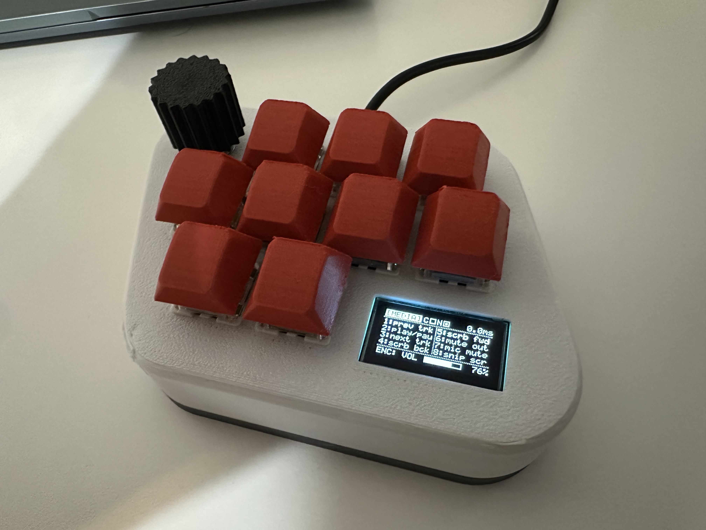
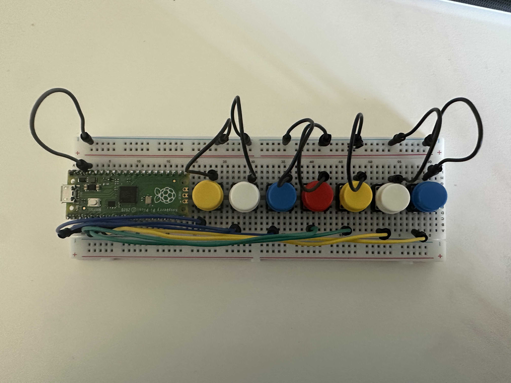
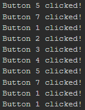
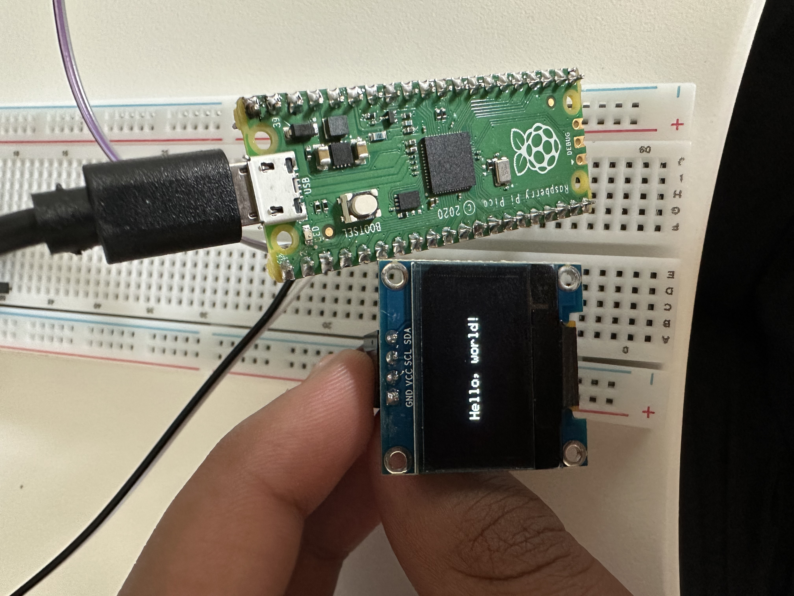
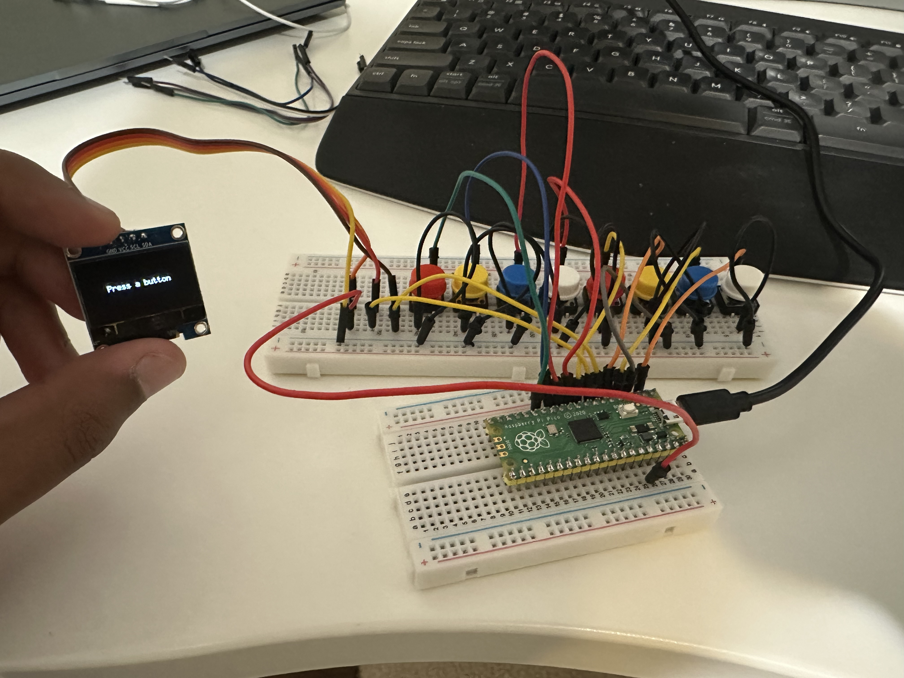
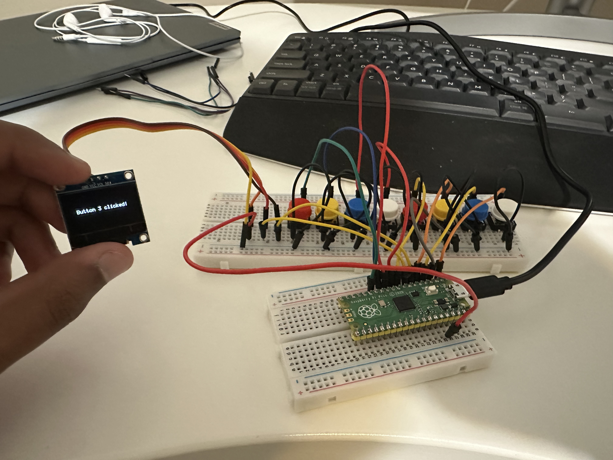
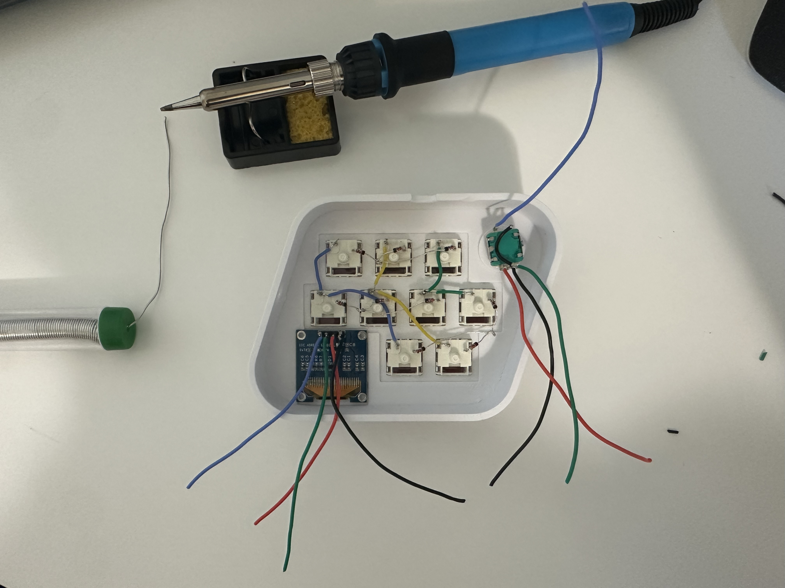

# Macro Keyboard

A 9-key USB macro keyboard built around a Raspberry Pi Pico: mechanical switches in a diode matrix, an EC11 rotary encoder, and a 128×64 SSD1306 OLED. It enumerates as a HID keyboard plus consumer-control device, with three layers (developer, media, window management).



Firmware lives in [`macro_keyboard_v1/`](macro_keyboard_v1/). Bring-up experiments that led to it are in [`bringup/`](bringup/).

## Features

- **9-key matrix** with per-key debounce and **B9 as a hold-FN** layer (keys without a shifted action keep their base mapping)
- **Three layers**, cycled by clicking the encoder: `[DEV]`, `[MEDIA]`, `[NAV]`
- **Encoder** for IDE zoom, volume, or window/tab switching (FN changes the action)
- **OLED** with live layer badge, Caps/Num lock, scan latency, and a host-fed volume bar in media mode
- **Non-blocking HID** keystroke queue so USB is not stalled by macros or I2C

## Tech stack

| Layer | Stack |
| --- | --- |
| MCU | Raspberry Pi Pico, RP2040 (dual Cortex-M0+), 133 MHz |
| Firmware | C11, Pico SDK **2.3.1**, CMake / Ninja, GNU Arm toolchain |
| USB | TinyUSB device stack — HID keyboard + consumer control + vendor IN/OUT |
| Display | SSD1306, 128×64, `i2c0` Fast Mode (400 kHz), 5×7 framebuffer font |
| Host helper | Python 3, `hidapi`, `pycaw` / Core Audio (Windows mixer → vendor HID) |
| CAD | [Onshape](https://cad.onshape.com/documents/8e5a88cf77f264f3291e7caf/w/3010a7862b44565054253d20/e/3c59f3f0abc7e3a62098627f) (enclosure + fit check), FDM 3D print |

USB identity: **VID `0xCAFE`**, **PID `0x4D4B`**. Composite device with two HID interfaces (boot-protocol none):

1. Keyboard (report ID 1) + consumer (report ID 2), interrupt IN `0x81`
2. Vendor usage page `0xFF00` IN/OUT (`0x82` / `0x02`) — 1-byte volume reports from the host

## Hardware

| Part | Role |
| --- | --- |
| Raspberry Pi Pico (RP2040) | USB device, GPIO, I2C |
| 9× mechanical switches | 3×3 matrix, diodes toward the rows |
| EC11 encoder | Layer select (click) and analog-style actions (turn) |
| SSD1306 0.96" OLED | I2C status / keymap display |

## Pin map

Physical Pico header pins in parentheses. All logic is 3.3 V.

### Switch matrix

Columns are MCU outputs (strobe high, one-hot). Rows are MCU inputs with pull-downs. Diodes point from the switch toward the row.

| Net | GPIO | Pico pin | Direction |
| --- | --- | --- | --- |
| COL0 | GP0 | 1 | Out |
| COL1 | GP1 | 2 | Out |
| COL2 | GP2 | 4 | Out |
| ROW0 | GP3 | 5 | In, pull-down |
| ROW1 | GP6 | 9 | In, pull-down |
| ROW2 | GP7 | 10 | In, pull-down |

Physical key at `[row][col]`:

```text
        COL0        COL1        COL2
ROW0    B1          B2          B3
ROW1    B5          B6          B7
ROW2    B4          B8          B9 (FN)
```

Settle time after strobe: 10 µs. Debounce: 6 ms (B9 / FN uses the raw scan so the modifier has no extra lag).

### EC11 encoder

| Signal | GPIO | Pico pin | Notes |
| --- | --- | --- | --- |
| SW | GP18 | 24 | Active-low, pull-up |
| CLK (A) | GP19 | 25 | Pull-up; Gray-code quadrature, 4 edges / detent |
| DT (B) | GP20 | 26 | Pull-up |
| COM | GND | 38 | Shared ground |

### SSD1306 OLED

| Signal | GPIO | Pico pin |
| --- | --- | --- |
| SDA | GP4 | 6 |
| SCL | GP5 | 7 |
| VCC | 3V3 OUT | 36 |
| GND | GND | 3 |

Bus: `i2c0`, 400 kHz, target address **`0x3C`**. On-chip pull-ups plus Pico GPIO pull-ups.

## Layers

Encoder **click** cycles `DEV → MEDIA → NAV`. **B9** is hold-FN (OLED tag gets `*`). Keys without a shifted action keep the base mapping.

### DEV

| Key | Press | FN |
| --- | --- | --- |
| B1 | `git status` + Enter | `git diff` + Enter |
| B2 | `git pull` + Enter | `git push` + Enter |
| B3 | Format (`Alt+Shift+F`) | Save (`Ctrl+S`) |
| B4 | Build (`Ctrl+Shift+B`) | same |
| B5 | Step over (`F10`) | Step in (`F11`) |
| B6 | Toggle breakpoint (`F9`) | Clear breakpoints (`Ctrl+Shift+F9`) |
| B7 | Clear terminal (`Ctrl+L`) | SIGINT (`Ctrl+C`) |
| B8 | Run tests (`Ctrl+F5`) | Toggle terminal (`Ctrl+\``) |
| Encoder | IDE zoom (`Ctrl` + `=` / `-`) | Command history (Up / Down) |

### MEDIA

| Key | Press | FN |
| --- | --- | --- |
| B1 | Previous track | same |
| B2 | Play / pause | Stop |
| B3 | Next track | same |
| B4 | Scrub back (Left) | same |
| B5 | Scrub forward (Right) | same |
| B6 | Mute output | Open music / mixer app |
| B7 | Mic mute (`Ctrl+Shift+M`) | Deafen (`Ctrl+Shift+D`) |
| B8 | Snip screen (`Win+Shift+S`) | Record screen (`Win+Alt+R`) |
| Encoder | Master volume (HID consumer) | Fine seek (`,` / `.`) |

### NAV

| Key | Press | FN |
| --- | --- | --- |
| B1 | Task view (`Win+Tab`) | File Explorer (`Win+E`) |
| B2 | Snap left (`Win+Left`) | Maximize (`Win+Up`) |
| B3 | Snap right (`Win+Right`) | Minimize (`Win+Down`) |
| B4 | New tab (`Ctrl+T`) | Reopen tab (`Ctrl+Shift+T`) |
| B5 | Close tab (`Ctrl+W`) | Tear tab (`Ctrl+Shift+K`) |
| B6 | Show desktop (`Win+D`) | Settings (`Win+I`) |
| B7 | Close window (`Alt+F4`) | Task Manager (`Ctrl+Shift+Esc`) |
| B8 | Lock (`Win+L`) | Clipboard (`Win+V`) |
| Encoder | Alt+Tab (held Alt until idle) | Ctrl+Tab |

Typed strings such as `git status` are queued as sequential HID reports (12 ms down / 8 ms up) with no `sleep_ms()` in the USB path.

## Firmware architecture

`macro_keyboard_v1.c` is a single-file TinyUSB application. The loop is:

1. `tud_task()` — USB endpoint handler first  
2. Matrix scan + encoder quadrature  
3. HID queue pump (keyboard and consumer reports)  
4. OLED: dirty or 250 ms telemetry refresh, **one page per iteration** (~25 FPS cap, 40 ms frame floor)

OLED layout (128×64):

| Zone | Y | Contents |
| --- | --- | --- |
| Status | 0–11 | Inverted layer badge, Caps/Num boxes, scan latency |
| Matrix | 12–49 | Two columns of labels for B1–B8 (FN swaps names live) |
| Context | 50–63 | Encoder function; volume bar (0–100%) in MEDIA |

I2C writes use a 5 ms timeout so a missing display cannot hang USB. Caps/Num come from the keyboard HID output (LED) report.

Host volume: Windows cannot expose the mixer to a keyboard collection, so `host_sync.py` opens the **vendor** HID interface and writes `[report_id=1, percent]`. Keys still work if that helper is not running; the MEDIA bar then only follows local encoder steps.

### Build and flash

Pico SDK 2.3.x, CMake / Ninja (or the Raspberry Pi Pico VS Code extension). Open `macro_keyboard_v1/`, configure, build, and copy `build/macro_keyboard_v1.uf2` to the Pico in BOOTSEL mode.

### Volume helper (optional)

```powershell
cd macro_keyboard_v1/host
pip install -r requirements.txt
.\install_startup.ps1
```

That starts a hidden `pythonw` process and adds a Startup shortcut so the volume bar tracks Windows after login. Remove with `.\uninstall_startup.ps1`.

---

## How it was built

The goal was one working product, not a pile of unrelated sketches. Each bring-up firmware proves one subsystem on hardware, then the next piece is added. The folders under `bringup/` are that sequence.

### 1. Parts and first bring-up

The minimum set was switches, an encoder, an I2C OLED, and a Pico. Those parts were ordered and proven one at a time on the bench (breadboard prototypes for everything except the last matrix test, which ran on the soldered matrix).

| Order | Firmware | What it proved |
| --- | --- | --- |
| 1 | [`bringup/button_test_firmware`](bringup/button_test_firmware) | Discrete GPIOs, debounce, USB serial |
| 2 | [`bringup/i2c_test_firmware`](bringup/i2c_test_firmware) | SSD1306 over `i2c0` |
| 3 | [`bringup/button_display`](bringup/button_display) | Buttons driving the OLED |
| 4 | [`bringup/prototype_firmware`](bringup/prototype_firmware) | Full HID keyboard on the breadboard (7 keys + encoder + OLED) |
| 5 | [`bringup/matrix_test`](bringup/matrix_test) | 3×3 diode matrix scan on the assembled board |

Direct GPIO buttons, then serial confirming each press:

| Breadboard | Serial |
| --- | --- |
|  |  |

OLED I2C bring-up (`Hello, world!`), then buttons driving the display:



| Idle | After a press |
| --- | --- |
|  |  |

A handheld DMM was the main tool for catching wiring mistakes before blaming firmware. Same checks on the breadboard prototypes and again on the soldered matrix:

| Mode | What it caught |
| --- | --- |
| **Continuity** | Open jumper, cold solder, header pin that never made it to the net, encoder COM not actually at GND |
| **Ohmmeter** | Switch closed vs open, diode orientation (matrix diodes toward the row), accidental shorts between adjacent cols/rows |
| **Voltmeter** | 3V3 / GND on the OLED, I2C idle high, column strobes actually going 0→3.3 V, encoder A/B/SW sitting at 3.3 V until a click or detent |

Firmware was only useful after those nets were proven. Ghost keys and a dead display were usually a wrong GPIO, a swapped diode, or a floating ground — not a bug in the scan loop.

### 2. Mechanical design

After the breadboard HID prototype, the enclosure was designed in [Onshape](https://cad.onshape.com/documents/8e5a88cf77f264f3291e7caf/w/3010a7862b44565054253d20/e/3c59f3f0abc7e3a62098627f), printed, and wired as a 3×3 diode matrix with the encoder and OLED in the case. Tests from the table above were re-run on that hardware before writing the shipping firmware.



Optional STEP/STL exports can go in [`docs/cad/`](docs/cad/).

### 3. Product firmware

[`macro_keyboard_v1`](macro_keyboard_v1) is the matrix keyboard: nine keys, global FN on B9, three layers, paced OLED, and the host volume path. That is the firmware meant to be flashed and used. The finished device is at the top of this README.

---

## Repository layout

```text
macro_keyboard_v1/     Product firmware, TinyUSB config, optional host helper
bringup/                Ordered hardware experiments (see table above)
docs/photos/            Bring-up and assembly photos
docs/cad/               Optional CAD exports
```
